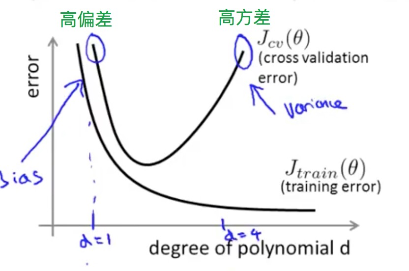
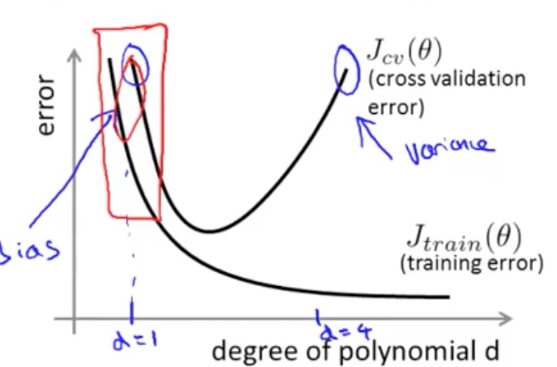
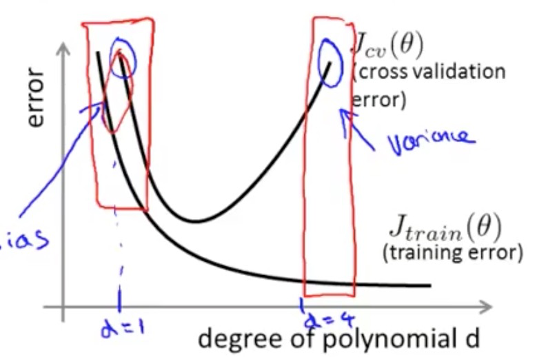
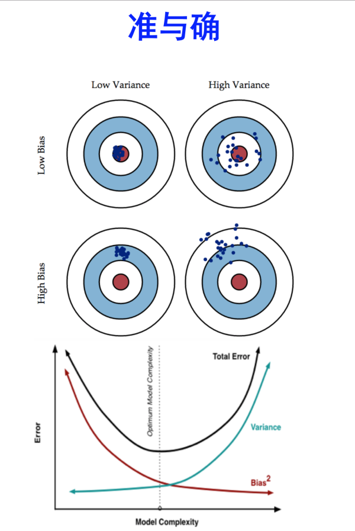

## 机器学习中的偏差(Bias)和方差(Variance)

- 机器学习中，偏差反应了一个模型对训练数据的拟合程度，看下图左上角较高的地方，由于参数过少（一元线性回归），不论是对测试数据和还是训练数据，都达不到很好的预测效果，简单来说，**偏差(Bias)表现了一个模型training error值的高低**
    - 高偏差易发生在模型过于简单的场景下
    - 高偏差易发生在深度学习epoch数量较少的时期

    
- 随着机器学习模型的复杂度不断增加（比如模型的参数，线性回归的元数），训练数据的拟合越来越小(偏差越来越小)，模型将会偏向训练数据，即所谓的过拟合——在训练数据上表现良好，但是在验证数据上的的表现不好，如下图的右边情况，简单说，**方差描述了一个模型训练数据与测试数据上表现的差距**
    - 高方差易发生于模型过于复杂的场景
    - 高方差易发生于深度学习多epoch后期
    

经常看到有人使用这张图来代表Bias和Variance的关系，这里说明这张图片的表达意义。

- 打靶准：表示的是预测的点与真实目标（靶心）的差距，对于前面来说，也就是偏差大小，如上图的上方两张图，预测点的中心距离靶心较近，因此偏差较小
- 手稳：在训练数据以及测试数据上的表现一致性，如果一致性越高，表示打靶的手越稳，不会出现二者差异很大的情况，也就是方差较小，如上图的左侧两张图，表现为方差较小

