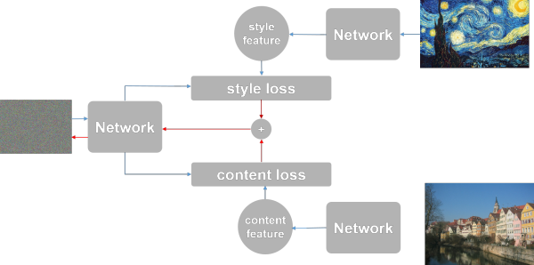

### 卷积神经网络可视化

#### CS231n上的三个可视化方法：

- Class Score Max: 

  - 随机生成`H x W x 3` 噪声图片，forward一遍，使用某类score对输入图片的backward更新图片，并计算class score，当score超过阈值(如0.99)时停止迭代此时画出图像
  - 使用此方法需要加上**L2正则化**才能使图像的可辨识度跟高价高，L2正则化可以使大量的像素趋于小数值，典型L2正则化 $\lambda = 10^{-7}$ 可以获得不错的效果

-  Feature Inversion复原图像：

  - 先将目标图像输入网络，做一遍forward，保存某一层的输出out

  - 随机生成`H x W x 3` 噪声图片，使用forward结果与out的**欧几里得**距离作为目标函数forward，backward，对随机图像求导，并更新图像，结果即寻找一个$I^*$使得:
    $$
    I^* = arg \min_{I'} ||\phi_l(I) - phi_l(I')||_2^2 + R(I')
    $$
    其中，$R(I')$ 是I‘的L2正则化参数，l表示目标层，最后输出图像，几乎可以还原图像原本的特征
    
    ===
    
    4月20日更新：
    在查看了拜读了Keras中文文档的作者的[知乎专栏](https://zhuanlan.zhihu.com/p/23479658)，并阅读了Keras这部分的[示例代码](https://github.com/wangyanjie1200/keras/blob/master/examples/neural_style_transfer.py)后，了解了卷积层特征图对图像还原的作用，在以上的公式中的一部分
    
     $$
        ||\phi_l(I) - phi_l(I')||_2^2
     $$
     
    这个其实就是简单的**欧几里得距离（矩阵差值二范数）**。在风格迁移的过程中，这个距离被用作是与内容的距离loss，loss越小，则生成的新图像在内容上越接近于内容图像。
    
    同样，在除了内容loss，还有风格loss，主要是通过两张图片在某一卷积层输出的特诊图对应`Gram矩阵差值二范数`来代表两张图片的风格loss差异
    
    在风格迁移的应用中，`内容loss`和`风格loss`的加权和（有时还加上`全变差正则loss`）被用作最终的loss，后生成梯度，作用在噪声图片上，以获得**内容上像原图，风格上像风格图**的效果

    
    

    风格迁移主要算法如图所示，
    这张图的表述其实不是非常清楚， 我有另外画了一张图放在下面
   
    
    
    意义很清楚，通过内容图像与噪声图像求内容loss，通过风格图像与噪声图像求风格loss，最后加权和作为最终的优化目标，求出梯度作用于噪声图片中，数次迭代后loss不断降低，得到结果

    ===

-  DeepDream:

  - 来源于google post的想法
  - 将一张待Dream的图像输入，做forward到目标层L，直接对图像自身做backward求出梯度，更新图片本身
  - 不断迭代多次，当停止时，Daydream已经形成
  - 其原理是增强原本的激活值特征，使图像中已经有的特征强化，例如神经网路觉得某个云很像狗，会继续加强狗的特征，最后会在云中出现狗的形状

