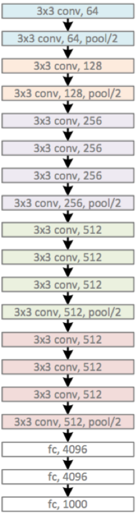
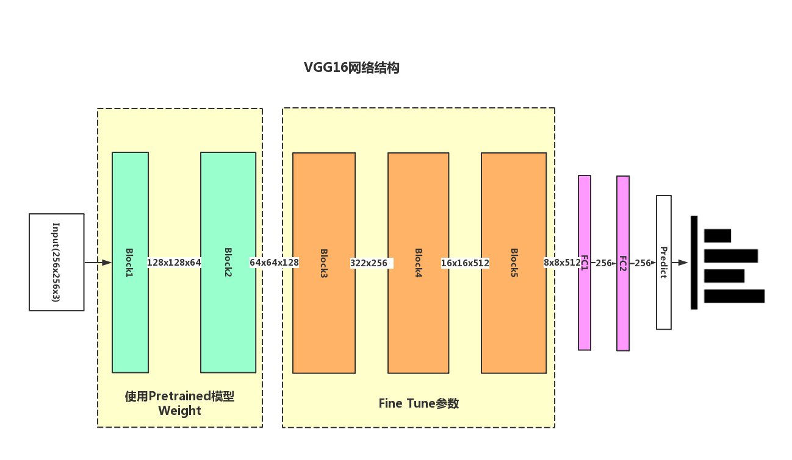

### 深度学习识别阴道镜HISL总结与展望
***

#### 现有研究弊端
- 目前现有的研究主要基于图像处理方法以及传统的机器学习方法
- 模型过于简单，无法处理较复杂的医学图像
- 单张图片特征有限，因此识别率较低

#### 我们如何改进
- 基于目前在图像识别领域效果较好的深度学习
- 深层网络有较强的学习能力，可以更好的应用到较复杂的医学影像识别中
- 采用多图片输入，增加图像特征

#### 目前网络结构
原VGG19网络结构

Finetune VGG16 结构：

- 由于在大型ImageNet数据集上与训练的前几层具有很好的泛化能力，故使用预训练的VGG16权值FineTune
- 单张图片的特征有限，使用多图片输入，将
`未处理`，`醋酸处理`， `碘液处理` 的三张图片同时输入VGG网络，通过三个前两个Block权值共享的VGG网络，得到各自的网络输出，最后将输出结果合并后送入全连接层进行分类，得到最后预测结果。

#### 目前遇到的主要问题
- 数据量较少（目前只有2200个病例）过拟合现象较严重
- 图像本身存在问题
    - 普遍存在医疗器械（棉签，器材等）和其他皮肤组织
    - 存在较多非典型病例，如转化区完全不暴露或是术后检查图片等
- 先验知识不足

#### 未来优化方向
- 性能指标优化
    - 重点提升模型预测的**敏感度**和**特异性** 
- 网络结构调整
    - 尝试使用`ResNet`, `GoogLeNet`, `Inception`等最新网络结构
    - 多网络集成学习
- 减轻过拟合
    - 获取更多数据
    - 使用更多的数据增强
    - 使用Dropout, Maxout, Regularization等方法增加模型泛化能力 
- 增加网络先验知识
    - 结合论文中的图像处理方法准确提取转化区
    - 提高对医疗器械和其他组织去除的准确率

