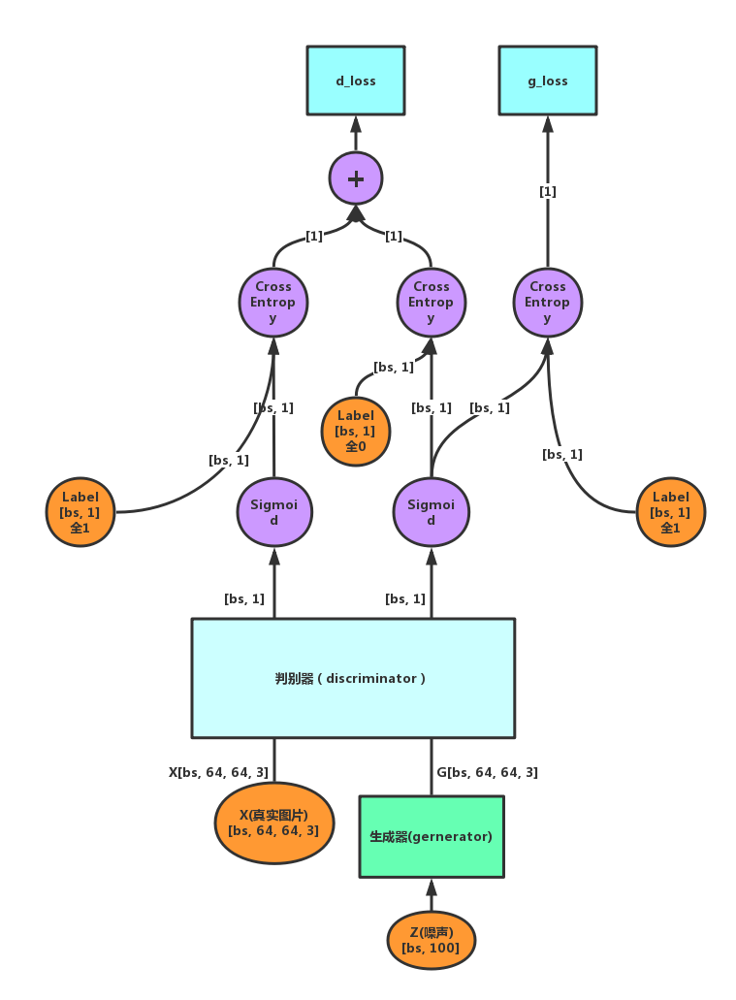
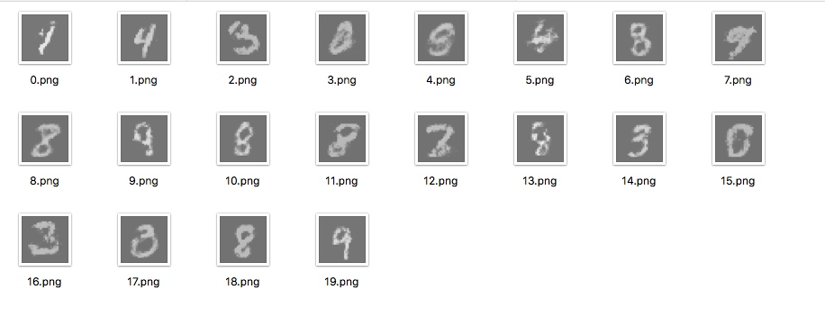

# GAN(生成对抗网络)旅程(1): 基础GAN

## 前言

GAN是今年发展起来的生成模型的典范，能够很好的生成一些训练数据集中没有的数据，这种模型的应用比较丰富，如可以使用GAN输入大量的字体然后让神经网络学会自己写字，如输入大量的设计稿，让GAN生成新的设计等等。

GAN的精髓在于**对抗**，通过判别器（discriminator）和生成器（generator）之间的你争我夺，最终是生成器能够生成是非难辨的数据

## 判别器

判别器作为GAN的主要组成部分之一，其本质是一个分类器（也就是任何可以输入原始数据，输出0，1分类的模型）为了BP的方便同意，GAN中的判别器一般是神经网络，可以使最简单的三层BP网络，也可以是VGG，ResNet等复杂结构的神经网路，若用上了**卷积层**，一般称为DCGAN。

判别器的主要作用是判别真假图片，而并不是传统分类器的分类数据内容，如是否患病，或图片中是不是狗之类的判定。

判别器输出0代表输入的图像是伪造数据(fake)，1代表输入图像是真实数据(real)。判别器的最终目的是完美的区分Generator生成的**伪造数据**和训练集中的**真实数据**

## 生成器

生成器的主要作用是通过一个噪声向量(noise)来生成一些真假难辨的伪造数据集，通过不断的训练，最终希望生成器能够成功的“欺骗”判别器，这个时候，就也可以使用生成器来生成一些能够“欺骗”人眼的数据，我们的最终目的就达成了

## 判别器与生成器的对抗过程

所谓对抗，在深度学习网络中很常见，如分类器尽量降低训练数据集上的loss，使用数据增强(Data Augmentation)来降低训练loss的收敛速度，这是一种对抗，loss和regularition的对抗同时如此。GAN的**对抗**源于判别器与生成器的tradeoff，就像是警察和小偷的关系，警察不断提升识破骗局的能力，道高一尺，魔高一丈，小偷在长期的压迫中也无法生存，唯有提高自身的骗术，长此以往，两个群体同时进化，能力也就不断提升，小偷的骗术足以“以假乱真”

说完了形象的，下面是具体的：
$$
    \min_G \max_D V(D, G) = E_{x \in p_{data}(x)}[\log{D(x)}] + E_{z \in p_z(z)}[\log{(1-D(G(z)))}]
$$

简单解释一下这个公式:

- D: 判别器
- G: 生成器
- x: 原图
- z: 噪声, 类似于产生位随机数的种子，相同的z生成的数据相同

这里的$(V, G)$仔细看，其实就是Cross Entropy加一个负号，我们看一下Cross Entropy的公式：
$$
    H = - \frac{1}{N} \sum_n^N[y_n \log{\hat{y}} + (1-y_n)\log{(1-\hat{y}_n)}] 
$$

$$
    H = - \frac{1}{N} \sum_n^N y_n \log{\hat{y}} - \frac{1}{N} \sum_n^N (1-y_n)\log{(1-\hat{y}_n)}
$$

当label为1使右边无效，当label为0使左边无效，这么看来是不是就是V(D, G)加一个负号了呢，因此，判别器希望$V(D, G)$越大越好，其实也就是Cross Entropy越小越好。

### Tensor Flow中的实现
接下来是GAN一个实现的Tensor结构图：


以输入图像大小是(64, 64, 3)为例：

首先我们手上有的数据有：

- 真实的训练图片[bs, 64, 64, 3],bs代表batch_size
- 生成器产生图片的种子(噪声)z[bs, 100]，这里的100可以任意，代表的只是种子的长度，100是一个典型的数量，噪声的长度在一定程度上回影响训练效果，因此也是一个超参数

就这两个，OK，现在开始forward！

1. 把X输入判别器网络，注意的是，这里的判别器输入size是X，输出$D$是一个[bs, 1]的tensor，表示batch中每个sample是真实数据的概率，对于判别器，每个sample输出越接近1越好，在判别器的上方还画了一个sigmoid函数，这个函数的作用自不用说，本来这个函数应该是要包含在判别器里面的，用来把太大的数压缩到(0, 1)区间内，为了看明白，我画在了外面
2. 经过$sigmoid$函数变换后，形状没有变化，还是[bs, 1]这个时候手工生成一个与这个形状一样的[bs, 1]全1向量，用来计算cross entropy，并作为最小化目标，这里我们把这个crossentropy记为real_loss.
3. 同样，将噪声[bs, 100]输入生成器得到[bs, 64, 64, 3]的输出，再把这个输出输入到判别器中，经过$sigmoid$函数同样也会得到一个[bs, 1]的向量，然后手工生成一个[bs, 1]的全0向量，用来计算Cross Entropy。这个crossentropy我们记为fake_loss
4. $Loss_{D} = Loss_{real} + Loss_{fake} $, 我们叫做d_loss
5. 接下来计算生成器的loss，第3步生成的[bs, 1]向量与一个手工生成的[bs, 1]全0向量一起计算一个crossentropy，这个loss记为g_loss
6. 好了结构定义完毕，现在只需要用两个optimizer最小化d_loss和g_loss就行了~

### 实战
***

接下来是一些代码(4月24日更新)

```python
# import necessary packages
import tensorflow as tf
import os
import numpy as np
from keras.utils import np_utils
from PIL import Image
import matplotlib.pyplot as plt
from tensorflow.examples.tutorials.mnist import input_data


# download/load tensorflow data 

mnist = input_data.read_data_sets('./MNIST_data', one_hot=True)


# 

n_epoch = 3000
batch_size = 64
h_dim = 128
z_dim = 100
n_sample = mnist.train.images.shape[0]


# Util functions definition

def flatten(x):
    out_dim = np.prod(x.get_shape()[1:].as_list())
    return tf.reshape(x, shape=(-1, out_dim))

def weight(shape):
    with tf.variable_scope('weight'):
        return tf.get_variable('weight', shape, initializer=tf.contrib.layers.xavier_initializer(), dtype=tf.float32)

def bias(shape):
    with tf.variable_scope('bias'):
        init = np.ones(shape, dtype=np.float32) * 0.1
        return tf.get_variable('bias', initializer=init, dtype=tf.float32)

def fc_layer(x, unit, tag=None, name=None, activation=None):
    with tf.variable_scope(name):
        in_dim = int(x.get_shape()[-1])
        out_dim = unit
        w = weight([in_dim, out_dim])
        b = bias([out_dim])
        if tag:
            tf.add_to_collection(name=tag, value=w)
            tf.add_to_collection(name=tag, value=b)
        out = tf.matmul(x, w) + b
        return activation(out) if activation else out
    
# As `mnist` dataset provided by `Tensorlfow` is # normalized (subtract by `mean` and divided by `std`)
# we need reversed option for normalization
# reference https://keras-cn.readthedocs.io/en/latest/blog/cnn_see_world/
def deprocess_image(x):
    # normalize tensor: center on 0., ensure std is 0.1
    x -= x.mean()
    x /= (x.std() + 1e-5)
    x *= 0.1

    # clip to [0, 1]
    x += 0.5
    x = np.clip(x, 0, 1)

    # convert to RGB array
    x *= 255
    x = np.clip(x, 0, 255).astype('uint8')
    return x

# save images to logging directory  
def save_image(G, epoch, n_imgs=20, img_size=(128, 128)):
    if not os.path.exists('out/epoch_{0}'.format(epoch)):
        os.mkdir('out/epoch_{0}'.format(epoch))

    imgs = G.eval(feed_dict={zs:sampler((n_imgs, z_dim))})
    for step, img in enumerate(imgs):
        img = deprocess_image(np.squeeze(img))
        img = Image.fromarray(img)
        img.resize(img_size).save('out/epoch_{0}/{1}.png'.format(epoch, step))
     
# show images in Jupyter Notebook   
def show_image(G, n_imgs=5):
    for step in range(n_imgs):
        plt.figure()
        img = G.eval(feed_dict={zs:sampler((1, z_dim))})
        img = deprocess_image(np.squeeze(img))
        plt.imshow(img, cmap='Greys_r')
        plt.show()


# Discriminator is a simple 3 layers BP network

def discriminator(x, name, reuse=False):
    with tf.variable_scope(name, reuse=reuse):
        tag = 'D' if reuse else None
        x = flatten(x)
        x = fc_layer(x, 128, activation=tf.nn.relu, name='d_fc1', tag=tag)
        x = fc_layer(x, 1, name='d_fc3', tag=tag)

        return tf.nn.sigmoid(x), x

def generator(z, name):
    with tf.variable_scope(name):
        x = fc_layer(z, 128, activation=tf.nn.relu, name='g_fc1', tag='G')
        x = fc_layer(x, 784, activation=tf.nn.sigmoid, name='g_fc3', tag='G')

        return tf.reshape(x, [-1, 28, 28, 1])


# uniform random generator

def sampler(shape, method='unif'):
    if method == 'unif':
        return np.random.uniform(-1., 1., size=shape)
    return np.random.random(shape)


# plot 16 images in one Image
def plot(samples):
    import matplotlib.gridspec as gridspec
    fig = plt.figure(figsize=(4, 4))
    gs = gridspec.GridSpec(4, 4)
    gs.update(wspace=0.05, hspace=0.05)

    for i, sample in enumerate(samples):
        ax = plt.subplot(gs[i])
        plt.axis('off')
        ax.set_xticklabels([])
        ax.set_yticklabels([])
        ax.set_aspect('equal')
        plt.imshow(sample.reshape(28, 28), cmap='Greys_r')

    return fig


# Model building

xs = tf.placeholder(tf.float32, shape=(None, 28, 28, 1), name='input')
ys = tf.placeholder(tf.float32, shape=(None, 10), name='label')
zs = tf.placeholder(tf.float32, shape=[None, z_dim], name='noise')

G = generator(zs, name='generator')
D_real, D_logit = discriminator(xs, name='discriminator')
D_fake, _D_logit = discriminator(G, name='discriminator', reuse=True)

# Loss definition
real_loss = tf.reduce_mean(tf.nn.sigmoid_cross_entropy_with_logits(labels=tf.ones_like(D_logit), logits=D_logit))
fake_loss = tf.reduce_mean(tf.nn.sigmoid_cross_entropy_with_logits(labels=tf.zeros_like(_D_logit), logits=_D_logit))

d_loss = real_loss + fake_loss
g_loss = tf.reduce_mean(tf.nn.sigmoid_cross_entropy_with_logits(labels=tf.ones_like(_D_logit), logits=_D_logit))
d_optim = 

# Optimizer: Adam with learning rate=2e-4
tf.train.AdamOptimizer(2e-4).minimize(d_loss, var_list=tf.get_collection('D'))
g_optim = tf.train.AdamOptimizer(2e-4).minimize(g_loss, var_list=tf.get_collection('G'))


# Tensorflow variables initialization

sess = tf.InteractiveSession()
sess.run(tf.global_variables_initializer())


#  Training steps

d_step = 1
g_step = 2

for epoch in range(n_epoch):
    for i in range(n_sample / batch_size):
        X_train, y_train = mnist.train.next_batch(batch_size)
        X_train = X_train.reshape((-1, 28, 28, 1))
        noise = sampler((batch_size, z_dim))
        
        for i in range(d_step):
            _, d_loss_out = sess.run([d_optim, d_loss], feed_dict={xs:X_train, zs:noise})
            
        for i in range(g_step):
            _, g_loss_out = sess.run([g_optim, g_loss], feed_dict={zs:noise})
        
    print  d_loss_out, g_loss_out
    if epoch % 5 == 0:
        #save_image(G, epoch)
        show_image(G)
```

**这里有几个找了好久在找出来的坑**

1. noise的生成问题:

之前一直用`np.random.random((batch_size, z_dim))`来生成噪声（训练噪声和测试噪声）,导致生成的所有图片基本完全一样，而且一直收敛不了，后来看了很多才知道原来是random的原因，其他作者的代码上基本都是`np.random.uniform()`换了以后就能正常生成了

2. 训练冻结问题

原来在训练生成器的时候没有冻结判别器，这样训练生成器的时候会对判别器造成破坏性的影响，导致网络一直无法收敛这点需谨记

3. 训练技巧

判别器与生成器需要保持一个权衡，在learning_rate相同的情况下，若两个网络的结构不同（如层数，或是参数数量）有可能出现一个网络被另一个网络吊打的情况，“吊打”的意思是说一个网络的loss很容易收敛到很小，但另一个网络loss过分的大，降不下来，而且可能一直升高，这个时候解决方法是多次运行其中一个网络的optim，调参达到最佳效果


80个epoch以后生成的数据


### 总结
这里所讲的GAN是GAN的最基本形式，随着不同的论文提出了不同的Idea，会接触到更为复杂的GAN，下一次可能会写有关CGAN的Note。


