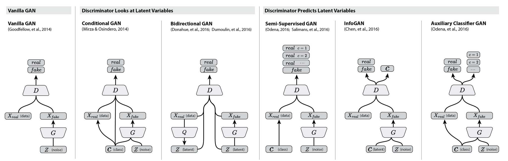
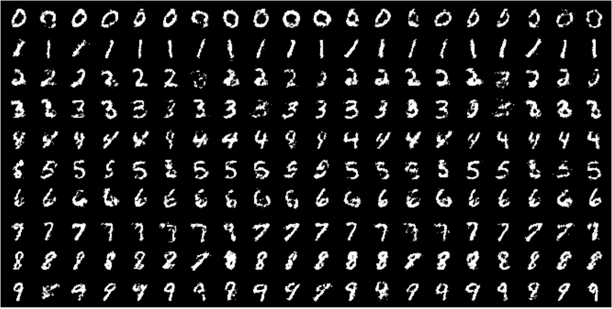
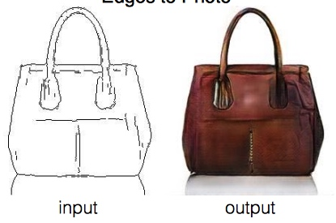

## GAN第二弹：CGAN与Wasserstein GAN

### 前言

GAN自从Good Fellow提出以来，在学术界引起了轰动，各研究者都争相投入GAN的研究来。然而，传统GAN存在着“难训练”，“Generator损失和Discriminator损失无法指示训练进程”等弊病，并且伴有严重的输出缺乏多样性和容易产生“模式坍塌”等问题，使原始GAN虽然理想和美好，但是现实很骨感~

为了解决GAN的各种问题，各家都提出了自己的方法，这里介绍比较典型的**条件GAN(CGAN)**，和**Wasserstein GAN**两种GAN的改进算法。

一下是几种算法示意图一览：

### CGAN

我们都知道，GAN的原始形态，Vanilla GAN是无法控制生成样本的特征的，只能是“GAN生成什么就是什么”，这给GAN的应用带来了很大的麻烦：大部分时候我们希望生成数据的时候是有**条件的**，比如我们现在使用一个艺术画的数据集训练成了一个GAN，比如设计师想生成一张风景图，那么这个模型是无法做到的，只能生成任意主题的作品。无法指定我需要的是“风景”这个特征的图像。

条件GAN是为了解决GAN无法指定生成样本的特征而提出来的，他的核心是将样本的特征，如：

- 图像分类
- 图像轮廓
- 文字描述
- 图像语义

等等，总结来说，样本特征就是：**想要生成什么样的样本，使用向量来描述，这就是所谓的条件**，那么如何把条件加入训练中就是最大的问题了。现在我们以最简单的“类别”条件为例子，场景可以使MNIST手写数字分类，在原始GAN中，可能生成的是0~9任何的数字，加入“类别”这个条件，我们可以生成类别为5的图像。

#### CGAN的结构

先来看一下原始GAN的优化目标：

$$
    \min_G \max_D V(D, G) = E_{x \in p_{data(x)}}[\log(D(x))] + E_{z \in p_{z(z)}}[\log(1 - D(G(z)))]
$$

现在把条件概率加入原始GAN后可以得到：

$$
    \min_G \max_D V(D, G) = E_{x \in p_{data(x)}}[\log(D(x|y))] + E_{z \in p_{z(z|y)}}[\log(1 - D(G(z)))]
$$

其中只是比原始的GAN多了条件$y$，在我们的例子中，y表示类别。$D(x|y)$表示分类器判别x样本是类别y的概率

- 从网络结构上来看，就是discriminator(x, y)的输入值是(x, y)然后输出是[0, 1]的概率。同样的对于生成器，就是Generator(x, y)，输出是与x形状一致的图像，作为伪造图像。

- 从实现方法上看，基本是把y的信息以某种方式加入到输入向量中再输入到网络中，如果是最简单的三层神经网络，可以做简单的concat，当然还要其他的方法。

CGAN比较简单，其余的结构都和原始GAN一致

### 实验结果

实现代码：[cgan_tensorflow](https://github.com/wiseodd/generative-models/blob/master/GAN/conditional_gan/cgan_tensorflow.py)

可以看到生成类别还是比较一致的，比起原始的GAN图像能够更好的满足需求。

### CGAN的应用

- **pix2pix**：Image-to-Image Translation with Conditional Adversarial Networks
- 黑白照片上色
- 破损照片修复
- 图像语义分割
- [AutoDraw](https://www.autodraw.com)

