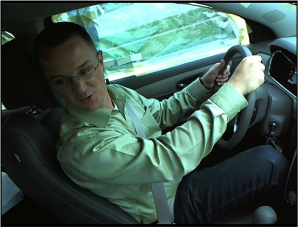

# Kaggle Top解法记录

本文是针对网上看到的一些Kaggle比赛大神的思路历程的记录，希望能够好好学习别人的思维模式，将来能够用在更多的地方。Kaggle上近期**计算机视觉**的题目比较多，如`宫颈癌转化区检测`，`鱼的种类分类`等等，在以后的学习中，**计算机视觉** 将成为很有重量的一个部分，因此有必要做一些记录。

本文主要资源页面：

1. [老司机坐稳了，Kaggle竞赛-深度学习检测疲劳驾驶简要回顾](https://zhuanlan.zhihu.com/p/26395021)
2. [数据挖掘进阶：kaggle竞赛top代码分享](https://zhuanlan.zhihu.com/p/26309073)  
3. [Kaggle Past Solutions](http://ndres.me/kaggle-past-solutions/)
4. [Kaggle Win Codes](http://shujianliu.com/kaggle-winning-code.html)

## State Farm Distracted Driver Detection

[疲劳驾驶检测比赛]()，这个比赛主要是通过车内的影像将司机分类为

- 正常驾驶
- 接电话
- 整理礼仪
- 等等十个分类

底下是几个Input Samples：

(这是一个参赛者制作的一个动图，大概把几桢连在一起看就是这个效果)

比赛特点：

1. 比赛给出的数据是Frame，即从视频中截取的帧数据，类似于是一个视频分析的比赛。知乎上给出了几个Top的解法。
2. 测试集大小比训练集大很多，所以很容易过拟合

### Top 1
[Summary链接](https://www.kaggle.com/c/state-farm-distracted-driver-detection/discussion/22906)

**主要模型**

Top1主要使用了VGG16的与训练模型作为basemodel，自己搞了一个叫VGG16_3的网络防止过拟合，特点如下：

- 提取了两个ROI
    - 头部检测区域(head region)
    - 右手检测区域(right hand region)
- VGG网络出了最后一层全部共享权值
- head region和right hand region加上原图共三个输入，经过共享权值的VGG16网络，最后一层(FC)各自训练，得到3个结果，最后得到结果(不知道怎么ensemble的)

**K_Nearest_Neighbor Average**

基本思想就是，使用预训练好的**VGG16**的**pool_5**输出得到的最终输出**(512 * 7 * 7)**拉平后的向量做**欧几里得距离**的K近邻算法，K=10，据作者所说，提高了0.1-0.2百分点

- 这个想法很简单，如果有很好的效果，那应该是和VGG的预训练模型有不错的特征提取有很大的关系
- 与传统的finetune不同的是，普通的finetune使用了`瓶颈特征`(深度学习网络除了最后的FC层的输出),而这个作者使用了K近邻作为最后一层的分类器
- 以前也看过一些在最后一层直接使用SVM作为Finetune的最后分类器，不过没有实践过，这个Top的做法给了一种新的思路，可以好好借鉴一下

**Ensemble Average**

ensemble的常见做法是所有类别的概率做平均以后argmax

- 作者发现有些分类器对某一个类别的准确率有提升，但是对其他的类别有时候会有反作用
- **因此在判别某个类的时候，只选择对这个类分类效果前10%的分类器计算ensemble average** 这种思想可以借鉴

### Top3
[Summary链接](https://www.kaggle.com/c/state-farm-distracted-driver-detection/discussion/22631)

Top3的思想主要融合了8个CNN的结果(8个。。。)，但最终只用了4个

