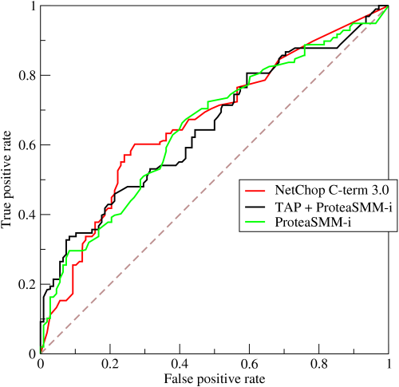

## 机器学习常用性能指标总结

### 序言

在机器学习中，性能指标(Metrics)是衡量一个模型好坏的关键，通过衡量模型输出`y_predict` 和 `y_true`之间的某种"距离"得出的。

性能指标往往是我们做模型时的最终目标，如`准确率`，`召回率`，`敏感度`等等，但是性能指标常常因为不可微分，无法作为优化的loss函数，因此采用如cross-entropy, rmse等“距离”可微函数作为优化目标，以期待在loss函数降低的时候，能够提高性能指标。而最终目标的`性能指标`则作为模型训练过程中，作为验证集做决定(early stoping或model selection)的主要依据，与训练结束后评估本次训练出的模型好坏的重要标准。

在机器学习的比赛中，有部分比赛也是用metrics作为排名的依据（当然也有使用loss排名）。

### 性能指标的分类

性能指标根据问题不同，主要分为：

- 回归类性能指标
- 分类性能指标

回归类性能指标，如RMSE，MSE等，**有待更新**

#### 二分类性能指标(最经常使用)

首先一说到二分类性能指标，一般都会祭出混淆矩阵，我们这里给出混淆矩阵：

|   | 预测1 | 预测0 | 合计 |
| :-: | :-: | :-: | :-: |
| 实际1(P) | $TP$ | $FN$ | $TP+FN(P)$ |
| 实际0(N) | $FP$ | $TN$ | $FP+TN(N)$ |
| 合计 | $TP+FP$ | $FN+TN$ | $TP+FN+FP+TN$ |

这里解释一下上面列联表的意思：
T/F表示预测是否正确，P/N表示 **预测**的label而不是实际的label，由于总是忘记这一点，一定要写出来

好了有了列联表就可以使用数学公式描述各个Metrics的含义了


##### 准确率(Accuracy):
***
   准确率是使用的最普遍的，也是最直观的性能指标，其定义如下：
$$
    \frac{TP+TN}{TP+FN+FP+TN} 
$$

意义是预测正确的sample占所有sample的比例，表示了一个分类器的区分能力，注意，这里的区分能力没有偏向于是正例还是负例，这也是Accuracy作为性能指标最大的问题所在

假设是一个地震的分类器，0表示没有地震，1表示地震，由于地震概率非常小(通常是1e-x级别，姑且认为地震的概率是0.0001吧)，因此，只要所有的例子来都猜是0，就能够是准确率(Accuracy)达到0.9999，使用Acc看来，这是一个好的分类器，而其实不然。对于地震的分类器，我们关心的是不是所有的正例全都被判别出来，至于一些时候，没有地震时，我们预测为1，只要在可接受范围内，那么，这个分类器就是一个好的分类器。

可以看到，对于*数据不平衡*或是当*某一方数据漏掉(通常是把这样的例子作为正例)时会产生很大的代价*的时候，我们需要更有效的指标作为补充。
    
##### 精确率(Precision):
*** 
有时也叫查准率，定义如下:
$$
     \frac{TP}{TP+FP} 
$$

从定义中可以看出，精确率代表的是：在所有被分类为正例的样本中，真正是正例的比例。简单的来说，

“你说的1有多大概率是1！”， 就是这个道理。

这个指标常常被应用于推荐系统中，对某一个商品，以用户喜欢为1，不喜欢为0，使用查准率进行性能衡量。
在这个问题中，查准率可以理解成“网易云音乐每日推荐的20首歌曲中，我喜欢的歌曲所占的比例”

##### 召回率(Recall):
***
 
也被称为查全率，在医学上常常被称作敏感度(Sensitive)，定义如下：
$$
    \frac{TP}{TP+FN}
$$
召回率的定义是，在所有**实际为正例的样本中，被预测为正例的样本比例**，简单说就是“**总共这么多1，你预测出了多少？**”

在医学领域(包括刚才说的地震)，常把患病(发生地震)这样的高风险类别作为正类，当漏掉正类的代价非常高，像是漏诊可能导致病人的延迟治疗，或是地震了没有预测出来将会产生巨大的人员伤亡时，召回率就派上用场了。

在医学中，必须极力降低**漏诊率**，而误诊相对于**误诊**(把负例判为正例)相对于漏诊的重要性就低了很多。


##### 特异性(Specificity):
***
特异性，定义如下：

$$
    SP = \frac{TN}{FP+TN}
$$

特异性的语义为：实际为负的样本中，有多大概率被预测出来，这个定义和`召回率`非常像，二者区别只是对象不同，召回率是针对正例，而特异性针对的是负例。可以简单把特异性理解成“负例查全率”。
特异性在医疗中也被认为是一个重要指标，为什么呢，因为特异性低也就是“误诊率高”，举一个极端例子，一个分类器把所有的样本都判定成患病，此时敏感度为1，但是有特异性却很低。因此，在医学领域，**特异性**和**敏感度**是需要同时考量的。

##### ROC曲线：

ROC曲线的全称叫做Receiver Operating Characteristic，常常被用来判别一个分类器的好坏程度，一下是一个ROC的例子：

上图引用自(http://alexkong.net/2013/06/introduction-to-auc-and-roc/)

首先看一下x轴坐标是**False positive rate**，即**假正例率**，其定义如下：
$$
    FPR = \frac{FP}{FP+TN}
$$

这个指标乍一看比较奇怪，但是仔细对比一下公式可以发现，$FPR = 1 - SP$假正例率代表的负例中没有查出来的概率，简单说是“总共有这么多0，分类器没有查出来多少”而没有查出来的，自然就都被分为1了，那么这些0就被误诊了，因此，FPR代表的其实是“误诊率”。
$$
    \frac{被误诊的人数}{所有健康的人数}
$$
就是他想表达的意思。

再看一下y轴是**True positive rate**真正例率，定义是：
$$
    TPR = \frac{TP}{TP+FN}
$$

回头看一下，其实就是敏感度和召回率啦~

ok，现在明白了，ROC的x轴是误诊率，y轴是漏诊率。可是一个分类器只可能得到一个数字，为什么会得出上图画出的那条曲线呢？

原来，画出ROC的曲线的方法不只是计算一次误诊率和漏诊率，按照以下方式进行：
    1. 将分类器预测为正例的概率从小到大排序
    2. 把每两个样本间的概率作为阈值，小于该阈值的分为负例，大于的分为正例
    3. 分别计算TPR和FPR
    4. 转2
    5. 当所有阈值都被枚举完之后，获得一组(TPR, FPR)的坐标点，将他们画出来。结束

这就是ROC曲线的画法，`sklearn`中已经对大量以上所说的性能指标做了实现，以下是ROC曲线在sklearn中如何调用

```python
    from sklearn.metrics import roc_curve
    import matplotlib.pyplot as plt
    
    p_rate = model.get_prob(X) #计算分类器把样本分为正例的概率
    fpr, tpr, thresh = roc_curve(y_true, p_rate)
   
    plt.figure(figsize=(5, 5))
    plt.title('ROC Curve')
    plt.xlabel('False Positive Rate')
    plt.ylabel('True Positive Rate')
    plt.grid(True)
    plt.plot(fpr, tpr)
    plt.savefig('roc.png')
```

有待更新……


