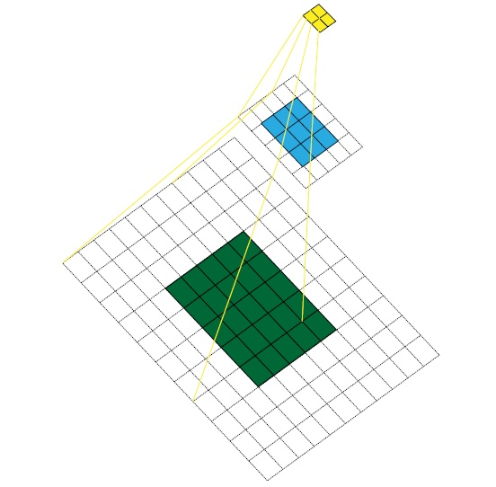
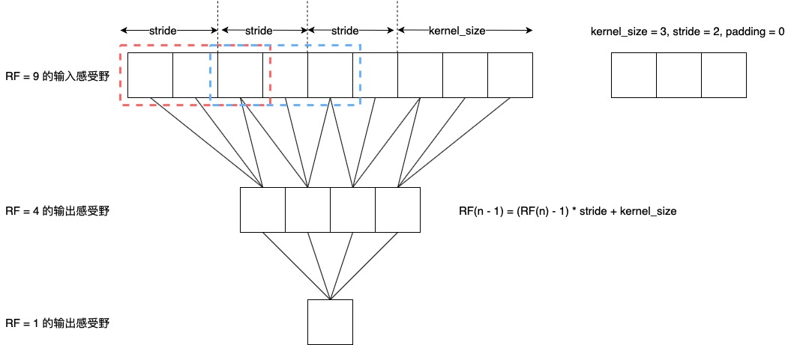
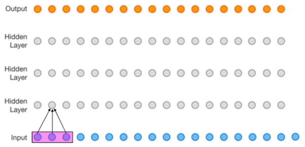
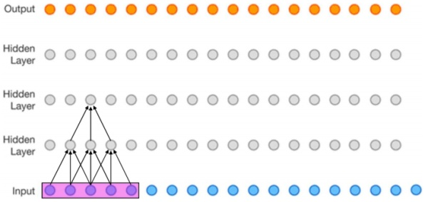
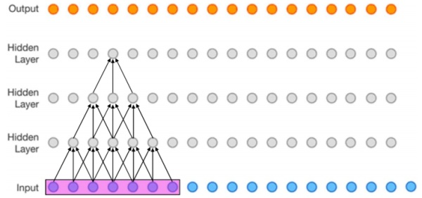

## 深入理解CNN中感受野计算

[TOC]

最近正在找实习，所以看了一些深度学习的基础知识，由于本人是做CV的，所以比较关注与CNN的基础，今天就这篇博客总结一些有关CNN中感受野计算的相关知识，希望对读者有所帮助。

### 什么是感受野(Receptive Field)

感受野(Receptive Field)是卷积神经网络衡量网络能“看”到多大的区域而定义的重要指标，一个网络的感受野决定了该网络能够识别多大的物体，举个例子，一个感受野为100x100的网络结构最多只能识别大约100x100这么大的物体，对于再大的物体，就无能为力了。我们接下来定义一下第i层对于第j层的感受野(可能不是特别严谨)：

> 如果第i层特征图上的每一个点，是由第j层的区域RF计算而来，我们称第i层相对于第j层的感受野为RF

解释一下上面这个定义，比如第i层特征图上的某一点是第i - 1的3x3区域计算来的，那么i相对于i-1的感受野就是3x3，而i - 1层上的3x3的区域，可能又是有i - 2层的5x5的区域计算来的，那么我们说i层相对于i - 2层的感受野为5x5。以下这张图比较形象的解释这个定义：



上图黄色层的每一点是由蓝色点中3x3的区域计算来的，而蓝色特征图上的3x3区域是绿色的5x5的区域计算而来的，因此黄色层对于绿色层的相对感受野是5x5，而我们一般说的网络某层的感受野指的是该层相对于输入层的感受野。

### 感受野的计算

#### 从输出向输入计算

了解了感受野的定义，那么我们如何计算感受野呢，我们先给出公式：
$$
RF(n - 1) = (RF(n) - 1)) \times stride + kernel\_size
$$
这个公式如何理解呢，首先我们可以很容易知道，如果我们要计算第i层的感受野，那么第i层的感受野本身应该是1的，而第i-1层的感受野就是其kernel_size，再往上返回计算，我们可以看以下这张图：



我们假设有这么一个网络：

- 输入100x100的图像
- 经过一个conv(3x3, stride=2)得出F1(49x49)
- 经过一个conv(4x4, stride=1)得出F2(46x46)

上图的第一层就是input，第2行是F1，第3行是F2，我们知道F2上的某一个点是有F1的4x4的区域计算而来，F2的4x4区域又是由F1的9x9区域计算而来，因此F2相对于input的感受野是9。9是如何计算而来的呢？

我们已经计算到RF(F2) = 4，由于上面的滑动窗口上需要摆放n-1个stride，然后在最后放上一个kernel_size，我们就可以很容易的可以推断出上面的公式：`RF(input) = (RF(F1) - 1) * stride(F1) + kernel_size(F1)`。

当然倒数第二层的感受野一定和kernel_size相等，这一点也可以根据公式得出，只需要把RF(n) = 1带入上面的公式就可以得出`(1-1) * stride + kernel_size = kernel_size`，所以不管如何，倒数第二层的相对感受野一定是kernel_size。

**Tips1：这里强调一下，我们这里所说的F1的RF=4，是指F2对F1的相对感受野为4，而不是F1相对于input的感受野，4只是一个中间变量，用来计算F1相对于input的感受野而已。那么F1真正的感受野改如何计算呢？只需要把F1的感受野设为0，带入以上公式就能很容易的得出，F1相对于input的感受野就是F1的kernel_size=3**

**Tips2：计算感受野的时候不考虑padding**

***

#### 从输入向输出计算

有了上面的感受野公式我们已经可以计算出一个网络的感受野了，但是这样计算感受野比较低效，因为如果有18层，我们想要计算每一层的感受野，就需要计算18+17+16…+1次，非常的麻烦（每层都得从输出往回算），有没有更加简便的方法，计算一次就能把所有层相对于input的感受野计算出来呢？我们给出另外一种前向计算感受野的方式，这里我借用了知乎上以为大佬的图（链接在[这里](https://zhuanlan.zhihu.com/p/40424530)）：

公式是这样的：
$$
RF(n + 1) = RF(n) + (kernel\_size_n - 1) \times feature\_stride_n 
$$

$$
feature\_stride = \prod_{i=1}^{l}stride_i
$$

首先我们从input往output计算，第一层对于input的感受野是kernel_size，同样很好理解，就不解释了：



第一层的感受野计算完毕后，我们按照感受野区域（粉红色的部分）按照stride向右滑动第二层的kernel_size - 1次，每次滑动stride长度，这样我们就得到了第二层对于input的感受野，这个计算过程是RF += (kernel_size - 1) * stride。



同样的我们可以计算第三层的感受野RF(3) = RF(2) + (kernel_size - 1) * stride



按照前向计算的法则，我们是不是能够计算出所有层对应的感受野了呢，上面给出来的是一个递归公式，我们现在把它转换成迭代公式，就是这个样子的：

$$
RF(1) = kernel\_size_1
$$

$$
RF(n) = \sum_{i=1}^{n} (kernel\_size_{i-1} - 1) \times feature\_stride_{i-1}
$$


### 实现一个“感受野计算器”

```python
def receptive_field_forward(layers):
    RF = [layers[0][0]] # RF(1) = kernel_size(1)
    stride = 1
    for i in range(1, len(layers)):
        k_i = layers[i][0]
        stride *= layers[i - 1][1]
        RF.append(RF[-1] + (k_i - 1) * stride)
    return RF

def receptive_field_backward(layers):
    RF = []
    for i in range(len(layers)):
        _RF = 1
        for kernel_size, stride in layers[::-1][i:]:
            _RF = (_RF - 1) * stride + kernel_size
        RF.append(_RF)
    return list(reversed(RF))
```

参考博客：
* [你知道如何计算CNN感受野吗？这里有一份详细指南](https://www.zybuluo.com/Team/note/1109819)
* [关于感受野的总结](https://zhuanlan.zhihu.com/p/40267131)
