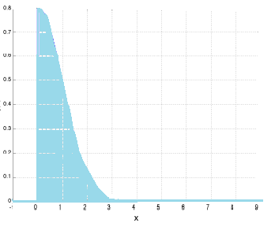

### 截断正态分布总结
链接：https://www.zhihu.com/question/49923924/answer/136319388
来源：知乎

1. ***Normal Distribution*** 正态分布，也称为高斯分布，***Truncated Normal Distribution*** 一般翻译为***截断正态分布***，也有称为截尾正态分布
2. 截断正态分布是截断分布(Truncated Distribution)的一种，那么截断分布是什么？截断分布是指，限制变量x取值范围(scope)的一种分布。例如，限制x取值在0到50之间，即{0<x<50}。因此，根据限制条件的不同，截断分布可以分为：    
    - 限制取值上限，例如，负无穷<x<50    
    - 限制取值下限，例如，0<x<正无穷    
    - 上限下限取值都限制
    
    例如，0<x<50正态分布可以认为是不进行任何截断，因为x取值可以从负无穷到正无穷。让变量x的取值，进行截断，有什么意义呢?通常，如果我们只关心在某一个氛围内的样本的分布时，会考虑使用截断的方法。例如，假设我们知道一个班级学生的成绩，是服从正态分布的，那么，这个班级中，如果只观察考试成绩前10名的同学，那么他们服从什么分布呢？

3. 截断正态分布知道了什么是截断分布，理解截断正态分布就容易了。如果，原来X服从正态分布，那么，对X的取值加一些限制条件之后，带有限制条件的X就服从截断正态分布了。同样，限制条件还是分为三种情况：限制取值上限、限制取值下限、上限下限取值都限制。因此，截断正态分布，除了具有正态分布的两个参数——均值、方差之外，还有另外两个参数：    取值上限（可以取正无穷）    取值下限（可以取负无穷）对于服从正态分布的x，限制x的取值，就可以得到x的截断正态分布。例如，原始x服从标准正态分布，通过限制下限为0，上限为正无穷，得到截断标准正太分布的概率密度函数如下：
 
4. 需要注意的是，任何密度函数曲线下方的面积是1。因此，截断，并不意味着直接把原始密度函数两边去掉一部分；而是，截断后概率密度函数曲线会有一些变化，使得总面积仍然为1。需要注意的是，任何密度函数曲线下方的面积是1。因此，截断，并不意味着直接把原始密度函数两边去掉一部分；而是，截断后概率密度函数曲线会有一些变化，使得总面积仍然为1。4. 截断之后概率密度函数如何重新计算？假设X原来服从正太分布，那么限制x的取值在（a，b）范围内之后，X的概率密度函数，可以用下面公式计算：
$$
    f(x; \mu, \sigma, a, b) = \frac{\frac{1}{\sigma}\phi(\frac{x - \mu}{\sigma})}{\Phi \frac{(b - \mu)}{\sigma} - \Phi \frac{(a - \mu)}{\sigma}}
$$
显然，对于（a，b）范围之外的那些x，对应的概率密度 f=0。上式中，小写的$\phi$，表示：
$$
    \phi(x) = \frac{1}{\sqrt{2\pi}} exp(-\frac12x^2)
$$
是标准正态分布。大写的$\Phi$，是标准正态分布的累积分布(cumulative distribution function)——某个值左边的面积总和。

