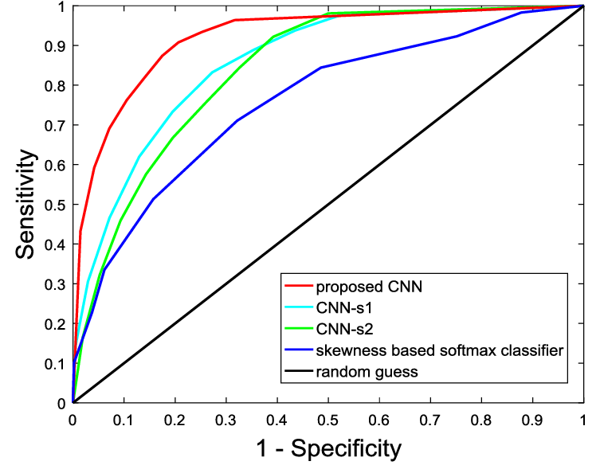

检测中mAP的计算

参考博客 http://blog.sina.com.cn/s/blog_9db078090102whzw.html

## 多标签分类中的AUC与mAP

检测的指标和多标签分类的mAP非常相似，因此我们先从多标签分类的指标开始说起，多标签分类中的指标往往不能使用简单的accuracy，recall来表示，需要综合考虑各种指标来衡量一个模型的性能，这种指标包括F1值，AUC值，mAP等等，本篇笔记主要讨论mean average precision（mAP）的计算方法。

简单来说，mAP和AUC指标很像，都是计算曲线下的面积，我们先说一下AUC值的计算吧，在我们计算AUC值的时候，通常先对置信度进行排序，然后按照以其中每一个置信度作为阈值，大于该阈值的样本认为是正例（P），小于阈值的认为负例（N），根据预测标签是否正确又分为真正例（TP），假正例（FP），真负例（TN），假负例（FN），也就是常说的”混淆矩阵“。有了这个阈值下的混淆矩阵，我们就可以求出该阈值下的FPR和TPR，这里的TPR也就是常用的“召回率”，而FPR本质是"1-特异性"，对于每一个置信度阈值都重复以上过程，就得出了一组TPR和FPR，画在坐标上，也就形成了，该模型的ROC曲线(Receiver Operating Characteristic)

由于阈值的一般是从1.0取到0.0，因此会出现两个特殊端点：(0，0)和(1，1)这个也比较好理解，因为在阈值为0的时候，所有的样本都被预测为正例，因此TPR(召回率)=1，特异性为0，所以FPR=1，另外一个端点刚好相反，最后计算该曲线的线下面积，就求出了我们要的AUC值。



那么mAP又是怎么一回事呢，大部分的步骤与AUC相仿，只不过把其中的TPR和FPR曲线换成了Recall和Precision而已，这两个参数使用混淆矩阵同样可以求出。

## 检测中的mAP

目标检测任务中的mAP计算源于机器学习中的mAP计算，不过由于Ground Truth框的数量和预测框的数量通常是不一致的，例如一张图片上有2个人，但是可能模型预测出了10个框，或是只预测出一个框，都是有可能的，因此不能想上一小节说的，一个框对应一个label，然后求PR曲线。

现在的关键点在于如何定义混淆矩阵的四个值，这个问题仔细思考一下我们很容易想到：首先是如何定义正负例？这个没问题，模型预测出来的框我们都可以认为是正例，其余没有预测出来的区域都认为是负例，而真假我们这样定义：**如果预测框与某一个GT的IoU大于阈值t，我们就认为是真正例（TP），否则认为是假正例（FP）**，乍一看很对啊，无懈可击，但是再仔细想一下，如果某个检测器比较“狡猾”，在一个物体上预测大量的相似的检测框，这些检测框与该GT的IoU都很大，因此TP也会很多，导致Precision指标表现为“虚高”。这种情况多出现的多吗？非常多，在没有非极大值抑制（nms）的模型中，大量的重复框会造成这种情况。

当然这不是我们想要的，因此在VOC的指标中，对于每一个预测框我们求与之IoU最大的GT，如果这个IoU大于阈值t，我们会把该GT标记为“已预测”，如果后来的预测框对应的最大IoU的GT被标记胃已预测，那么也会被认为是FP，这就解决了模型无法通过这种投机的方法获得高指标。而且由于置信度是从高取到低的，这样每一个GT如果被覆盖了，那一定是被最高置信度的预测框所覆盖。

现在我们可以重新定义一下混淆矩阵的几个值的意义：

- `TP`: 预测框与某个GT的IoU大于t，且没有更高置信度的预测框覆盖该GT
- `FP`: 预测框与所有的GT的IoU都小于t，或是与某个GT的IoU大于t，但是该GT已经被置信度跟高的预测框所覆盖
- `TN`: ？？
- `FN`: 与任何预测框的IoU都小于阈值t的GT数量

然而，我们并不能计算TN，因为其数量实在太大，严格意义上来说，所有没有预测出来的框都可以算是N，所以而我们预测出来的负例也非常多（没有预测出来的都是负例），好在我们计算Recall和Precision也用不到TN，为什么呢，看一下Recall和Precision的公式：
$$
Recall = \frac{TP}{TP + FN}
$$

$$
Precision = \frac{TP}{TP + FP}
$$


不需要TN~注意到Recall的分母其实是所有GT的数量之和，所以在实现的时候不需要单独求TP和FN的值

## VOC2007检测指标

11-point interpolated average precision

如果每一个对于每一个阈值来说，Recall和Precision都可以求出来，那就可以求线下的面积了，方法也很简单，使用Recall作为横轴，Precision作为纵轴，由于随着阈值扩大，Recall肯定是从0变化到1的，这样可以对于坐标系上的每一个点$(recall(t), precision(t))$，我们做一个加和$AP = \frac{1}{T} \sum_{t=1}^{T} recall(t) \cdot precision(t)$，就可以求出来整个线下面积。

不过为了计算速度，VOC2007的指标只在横轴上采样11个，分别是(0.0, 0.1, 0.2, 0.3, 0.4, 0.5, 0.6, 0.7, 0.8, 0.9, 1.0)，在这些点上求precision，加和以后除以11，也就是所谓的`11-point interpolated average precision`

## Python版VOC指标代码分析


```python
def voc_eval(detpath,
             annopath,
             imagesetfile,
             classname,
             cachedir,
             ovthresh=0.5,
             use_07_metric=False):

  # 首先获取GT路径
  if not os.path.isdir(cachedir):
    os.mkdir(cachedir)
  cachefile = os.path.join(cachedir, '%s_annots.pkl' % imagesetfile)
  # 读取图片的ID
  with open(imagesetfile, 'r') as f:
    lines = f.readlines()
  imagenames = [x.strip() for x in lines]

  # 载入GT的标注，如果cache已经存在，直接读取，否则读文件，写cache
  if not os.path.isfile(cachefile):
    # load annotations
    recs = {}
    for i, imagename in enumerate(imagenames):
      recs[imagename] = parse_rec(annopath.format(imagename))
      if i % 100 == 0:
        print('Reading annotation for {:d}/{:d}'.format(
          i + 1, len(imagenames)))
    # save
    print('Saving cached annotations to {:s}'.format(cachefile))
    with open(cachefile, 'wb') as f:
      pickle.dump(recs, f)
  else:
    # load
    with open(cachefile, 'rb') as f:
      try:
        recs = pickle.load(f)
      except:
        recs = pickle.load(f, encoding='bytes')

  # extract gt objects for this class
  class_recs = {}
  npos = 0
  for imagename in imagenames:
    R = [obj for obj in recs[imagename] if obj['name'] == classname]
    bbox = np.array([x['bbox'] for x in R])
    difficult = np.array([x['difficult'] for x in R]).astype(np.bool)
    det = [False] * len(R)
    npos = npos + sum(~difficult)
    class_recs[imagename] = {'bbox': bbox,
                             'difficult': difficult,
                             'det': det}

  # 加载模型预测框
  # 格式[img_id, x1, y1, x2, y2]共5维
  detfile = detpath.format(classname)
  with open(detfile, 'r') as f:
    lines = f.readlines()

  splitlines = [x.strip().split(' ') for x in lines]
  image_ids = [x[0] for x in splitlines]
  confidence = np.array([float(x[1]) for x in splitlines])
  BB = np.array([[float(z) for z in x[2:]] for x in splitlines])

  nd = len(image_ids) # 注意这里是预测框的总数量，而不是图片的数量
  tp = np.zeros(nd) # 初始化每个框的TP标志
  fp = np.zeros(nd) # 初始化每个框的FP标志

  if BB.shape[0] > 0:
    # sort by confidence
    sorted_ind = np.argsort(-confidence)
    sorted_scores = np.sort(-confidence)
    BB = BB[sorted_ind, :]
    image_ids = [image_ids[x] for x in sorted_ind]

    # go down dets and mark TPs and FPs
    for d in range(nd):
      R = class_recs[image_ids[d]]
      bb = BB[d, :].astype(float)
      ovmax = -np.inf
      BBGT = R['bbox'].astype(float)

      if BBGT.size > 0:
        # compute overlaps
        # intersection
        ixmin = np.maximum(BBGT[:, 0], bb[0])
        iymin = np.maximum(BBGT[:, 1], bb[1])
        ixmax = np.minimum(BBGT[:, 2], bb[2])
        iymax = np.minimum(BBGT[:, 3], bb[3])
        iw = np.maximum(ixmax - ixmin + 1., 0.)
        ih = np.maximum(iymax - iymin + 1., 0.)
        inters = iw * ih

        # union
        uni = ((bb[2] - bb[0] + 1.) * (bb[3] - bb[1] + 1.) +
               (BBGT[:, 2] - BBGT[:, 0] + 1.) *
               (BBGT[:, 3] - BBGT[:, 1] + 1.) - inters)

        overlaps = inters / uni
        ovmax = np.max(overlaps)
        jmax = np.argmax(overlaps)

      if ovmax > ovthresh:
        if not R['difficult'][jmax]:
          if not R['det'][jmax]:
            tp[d] = 1.
            R['det'][jmax] = 1
          else:
            fp[d] = 1.
      else:
        fp[d] = 1.

  # compute precision recall
  fp = np.cumsum(fp)
  tp = np.cumsum(tp)
  rec = tp / float(npos)
  # avoid divide by zero in case the first detection matches a difficult
  # ground truth
  prec = tp / np.maximum(tp + fp, np.finfo(np.float64).eps)
  ap = voc_ap(rec, prec, use_07_metric)

  return rec, prec, ap

```

